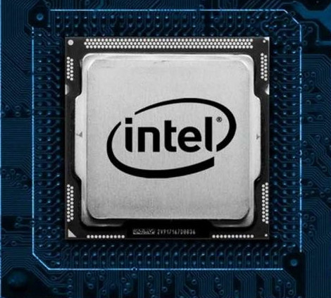

------------------

<!-- Visual resume  Intel, ARM, Inmos, Ferranti -->

# A visual work history

## Some web work - click to access

## Chip design

  
  <h2> &nbsp; &nbsp; &nbsp; Intel Corporation</h2>
  

     

  
  <h3> &nbsp; &nbsp; &nbsp; Sandy Bridge - (Core 2nd gen)</h3> 
  <h3> &nbsp; &nbsp; &nbsp; First integrated graphics </h3>

   

<h3> 
  &nbsp; &nbsp; &nbsp; 440BX chipset  
  &nbsp; &nbsp; &nbsp; If you still have one of these, it's time to upgrade 
</h3>

   

----

<h3> &nbsp; &nbsp; &nbsp; ARM810 Microprocessor</h3>
   

----

<h3>  &nbsp; &nbsp; &nbsp; Transputer - the T9000/H1/H42/HUMPH </h3>

    

---

  

---
---
 

  

  ### &nbsp; &nbsp; &nbsp; Well, sometimes a nickname sticks. I did get very sunburned that day ...

 
 

---------------------------------------

<!--  -->
<!--

Here are some ideas to get you started:

- 🔭 I’m currently working on ...
- 🌱 I’m currently learning ...
- 👯 I’m looking to collaborate on ...
- 🤔 I’m looking for help with ...
- 💬 Ask me about ...
- 📫 How to reach me: ...
- 😄 Pronouns: ...
- ⚡ Fun fact: ...
-->

<!-- Visual resume

- French, Spanish, Interrail
- Ferranti. How not to run a company
- Bristol, Computer Systems Engineering 
- Inmos
- Africa (Kilimanjaro)
- ARM
- Intel, 440 BX, Integrated Graphics - list of all chips
-->